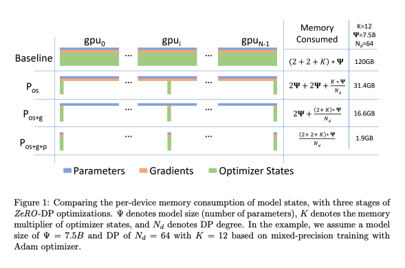

# Zero Redundancy Optimizer DP
- Authors: Jinwon Kim
- Paper: https://arxiv.org/abs/1910.02054

The Zero Redundancy Optimizer for Data Parallelism (ZeRO-DP) is a technique used to remove memory state redundancies and optimize computational efficiency in data parallel distributed deep learning. ZeRO-DP partitions the model states across data-parallel processes, eliminating the need for replication of model parameters, which in turn reduces memory usage and communication overhead during training.

## Optimizer State Partitioning (Level 1)
-  The optimizer states are partitioned across data parallel processes
## Gradient Partitioning (Level 2)
-  The reduced gradients are partitioned based on the corresponding parameter and are reduced only by the data parallel process responsible for updating those parameters. After the reduction, the memory can be released.
## Parameter Partitioning (Level 3)
- Similar to the optimizer states and gradients, each process only stores the parameters associated with its partition.

