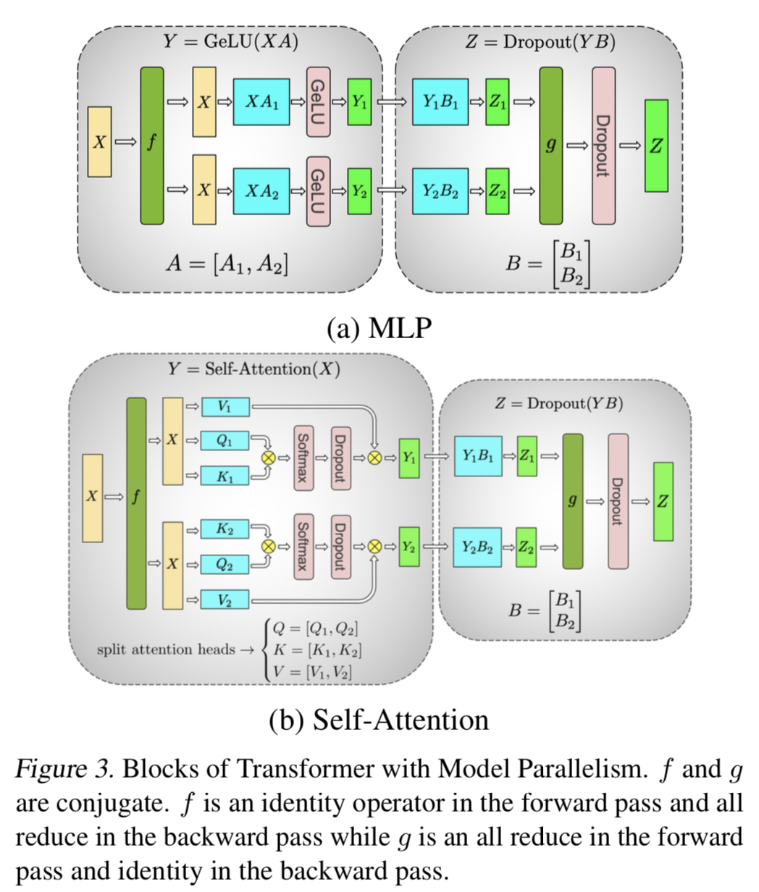

# 1D parallel algorithm (same as Megatron-LM)

[https://arxiv.org/pdf/1909.08053.pdf](https://arxiv.org/pdf/1909.08053.pdf)



Tensor parallelism is a technique that partitions model weights across multiple devices to reduce memory load. 1D tensor parallelism splits each layer of a model into smaller chunks along one dimension and distributes them among different devices. For example, a linear layer Y = XA can be split into column-parallel or row-parallel fashion. Column-parallel splits A into [A1 A2] and computes Yi = XAi on each device. Row-parallel splits B into [B1; B2] and computes Z = [Y1 Y2][B1; B2] using an all-reduce operation. Megatron-LM uses 1D tensor parallelism to train large-scale language models with billions of parameters on GPU clusters.

## Usage

Using `ParallelMode.TENSOR_1D` as a parameter of `tensor_parallel_mode`. Also, you should `tp_depth` to **1.**(tp_depth only used in 2.5d)

```python
# model = defined in section 2.2

from oslo import ParallelContext
from oslo.torch.nn.parallel import TensorParallel

tp_size = 4
tp_depth = 1

parallel_context = ParallelContext.from_torch(
    data_parallel_size=1,
    pipeline_parallel_size=1,
    tensor_parallel_size=tp_size,
    tensor_parallel_mode=ParallelMode.TENSOR_1D,
)
model = TensorParallel(model, parallel_context)
oslo.ready(model, parallel_context)
```