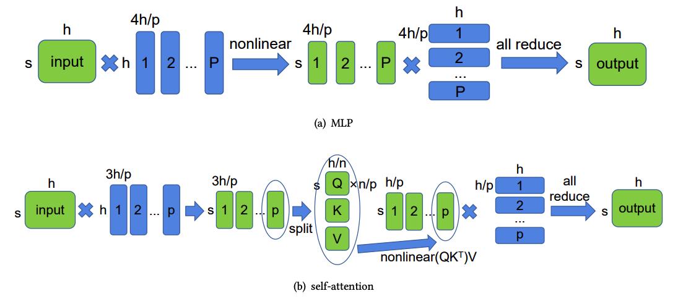

# 2D parallel (SUMMA) algorithm
- Authors: Kichang Yang, Kevin Ko, Minho Ryu
- Paper : [https://arxiv.org/pdf/2104.05343.pdf](https://arxiv.org/pdf/2104.05343.pdf)



The use of 1D tensor parallelism can lead to high memory consumption in large-scale models because it does not partition activations.
To address this issue, a more efficient 2D tensor parallelism algorithm based on SUMMA was introduced. This algorithm evenly distributes computation and memory load.
For instance, when computing a linear layer $Y = XA$, the input $X$ and weight $A$ are split into four sub-matrices and the calculation is done in two steps, broadcasting rows and columns of $X$ and $A$ in turn.
The result is a matrix $Y$ that is the product of $X$ and $A$.

## Usage

Use `ParallelMode.TENSOR_2D` as a parameter of `tensor_parallel_mode`. Since the algorithm splits model along both rows and columns, `tp_size` should be a **square of positive integer**.

```python
from oslo import ParallelContext, ParallelMode
from oslo.torch.nn.parallel import TensorParallel

tp_size = 4
tp_depth = 1

parallel_context = ParallelContext.from_torch(
    data_parallel_size=1,
    pipeline_parallel_size=1,
    tensor_parallel_size=tp_size,
    tensor_parallel_mode=ParallelMode.TENSOR_2D,
)
model = TensorParallel(model, parallel_context)
oslo.ready(model, parallel_context)
```