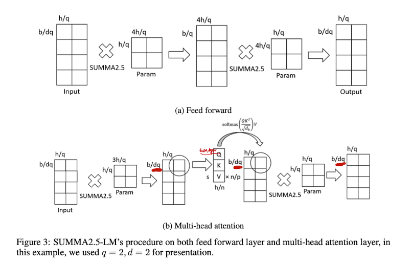

# 2.5D parallel (SUMMA-2.5) algorithm
- Authors: Kichang Yang, Kevin Ko, Minho Ryu
- Paper : [https://arxiv.org/pdf/2105.14500.pdf](https://arxiv.org/pdf/2105.14500.pdf)



The 2D parallelism algorithm has lower memory cost than 1D parallelism, but can increase communication. To address this, a 2.5D tensor parallelism algorithm based on 2.5D SUMMA was proposed, which reduces communication by using more devices. This algorithm involves splitting the input and weight matrices into smaller sub-matrices, and applying the SUMMA algorithm to each sub-matrix. The output is then computed by combining the results of each sub-matrix. This approach can be used for linear layers and other tensor operations.

## Usage

Use `ParallelMode.TENSOR_2P5D` as the parameter for `tensor_parallel_mode`. `tp_size` should be a multiple of `tp_depth`. 
It is recommended to set `tp_depth` to more than 1, as the algorithm becomes identical to the 2D algorithm if `tp_depth` is 1.

```python
# model = defined in section 2.2

from oslo import ParallelContext, ParallelMode
from oslo.torch.nn.parallel import TensorParallel

tp_size = 8
tp_depth = 2

parallel_context = ParallelContext.from_torch(
    data_parallel_size=1,
    pipeline_parallel_size=1,
    tensor_parallel_size=tp_size,
    tensor_parallel_mode=ParallelMode.TENSOR_2P5D,
    tensor_parallel_depth=tp_depth,
)
model = TensorParallel(model, parallel_context)
oslo.ready(model, parallel_context)
```