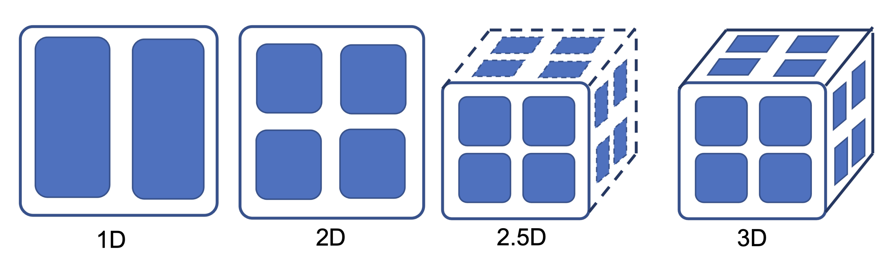

# Tensor Model Parallelism Tutorial
- Authors: Kichang Yang, Kevin Ko, Minho Ryu



**Tensor Model Parallelism**
makes it possible to train larger models by partitioning the parameter tensors into multiple dimensions. We also support 2D, 2.5D, and 3D tensor partitioning which make tensor parallel training more efficient unlike Megatron-LM which simply splits parameters into single dimensions such as rows and columns.

### Table of contents  
- [Tensor Model Parallelism Tutorial](#tensor-model-parallelism-tutorial)
    - [Table of contents](#table-of-contents)
  - [0. Distributed Launcher](#0-distributed-launcher)
  - [1. Inference](#1-inference)
    - [1.1. Create model and tokenizer](#11-create-model-and-tokenizer)
    - [1.2. Parallelize the model](#12-parallelize-the-model)
    - [1.2.1 Tensor Parallel Algorithms](#121-tensor-parallel-algorithms)
    - [1.3. Do inference as usual](#13-do-inference-as-usual)
  - [2. Training](#2-training)
    - [2.1. Initialize some variables](#21-initialize-some-variables)
    - [2.2. Create model, optimizer and tokenizer](#22-create-model-optimizer-and-tokenizer)
    - [2.3. Parallelize the model](#23-parallelize-the-model)
    - [2.4. Load dataset and create dataloader](#24-load-dataset-and-create-dataloader)
    - [2.5. Do training as usual](#25-do-training-as-usual)
    - [2.6. Save the parallelized model](#26-save-the-parallelized-model)
      - [2.6.1. Merging Checkpoints](#261-merging-checkpoints)
  - [Appendix. Multi-node Training](#appendix-multi-node-training)

## 0. Distributed Launcher

This tutorial must be launched using distributed launcher.

If you have 4 GPUs:

```bash
torchrun --nproc_per_node=4 YOUR_SCRIPT.py
```

If you installed Slurm in your environments, the following works the same.

```bash
srun --num_gpus=4 YOUR_SCRIPT.py
```

For more information of the distributed launchers, refer to:

- [Pytorch documents](https://pytorch.org/docs/stable/distributed.html)
- [DeepSpeed documents](https://www.deepspeed.ai/getting-started/#launching-deepspeed-training)

## 1. Inference

How to use the tensor model parallelism for inference?

### 1.1. Create model and tokenizer

Warning : model must be assigned in cpu, **not** **CUDA**

```python
from transformers import AutoModelForCausalLM, AutoTokenizer

model = AutoModelForCausalLM.from_pretrained("gpt2")
tokenizer = AutoTokenizer.from_pretrained("gpt2")
```

### 1.2. Parallelize the model

You can parallelize the model you defined is only 2 steps required. 

Just making define `parallel_context` , and call `oslo.ready` function. 

`parallel_context` Is the variable for define the method how to parallelize to oslo. 

Here is some explain about arguments to parallel_context.

- `tensor_parallel_size` must be same or smaller than total num of gpus.
- `tensor_parallel_size` must be power of 2. (e.g. 2, 4, 8, 16, ...)
- `tensor_parallel_size` must be positive number.
- `tensor_parallel_mode` support 4 types of tensor parallel algorithm. For more details, see section 1.2.1
    - TENSOR_1D : same as megatronLM
    - TENSOR_2D : Using summa algorithm.
    - TENSOR_2P5D : Using 2.5d summa algorithm ( much effective in Communication costs between layers. )
    - TENSOR_3D : Using cubic-3d algorithm
- `tensor_parallel_depth` must be If the mode is…
    - 2P5D : same or lower than `tensor_parallel_size`
    - Not 2P5D : must be 1.
- `pipeline_parallel_size` must be 1 if you want to use `tensor_parallel` algorithm ( mixing PP and PP will be supported in later version.)

```python
import oslo
from oslo import ParallelContext, ParallelMode
from oslo.torch.nn.parallel import TensorParallel

tp_size = 4
tp_depth = 1

parallel_context = ParallelContext.from_torch(
    data_parallel_size=1,
    pipeline_parallel_size=1,
    tensor_parallel_size=tp_size,
    tensor_parallel_mode=ParallelMode.TENSOR_1D,
    tensor_parallel_depth=tp_depth,
)
model = TensorParallel(model, parallel_context)
oslo.ready(model, parallel_context)
```

### 1.2.1 Tensor Parallel Algorithms

You can find the details of the algorithms in the CONCEPTS section.
see here: 
- [Concept of Tensor Parallel Algorithms](CONCEPTS/CONCEPTS.md#tensor-parallel-algorithms)

### 1.3. Do inference as usual

This is an example of text generation.
In addition to this, it can be used in various tasks such as sequence classification or masked lm.
Likewise, you can write the code as usual.

```python
text = "I don't want a lot for Christmas. There is just one thing"
tokens = tokenizer(text, return_tensors="pt").to("cuda")
print(tokenizer.decode(model.generate(**tokens, num_beams=3)[0]))
```

```
I don't want a lot for Christmas. There is just one thing I want to ...
```

## 2. Training

How to use the tensor model parallelism for training?

### 2.1. Initialize some variables

```
BATCH_SIZE = 4
SEQ_LEN = 64
SAVE_INTERVAL = 50
TRAIN_STEP = 100
```

### 2.2. Create model, optimizer and tokenizer

```python
from torch.optim import Adam
from transformers import AutoModelForCausalLM, AutoTokenizer

model = AutoModelForCausalLM.from_pretrained("gpt2")
optimizer = Adam(model.parameters(), lr=3e-5)
tokenizer = AutoTokenizer.from_pretrained("gpt2")

# Add pad token for batch training because GPT2 tokenizer doesn't have pad token.
tokenizer.pad_token = tokenizer.eos_token
```

### 2.3. Parallelize the model

```python
# model = defined in section 2.2

from oslo import ParallelContext, ParallelMode
from oslo.torch.nn.parallel import TensorParallel

tp_size = 4
tp_depth = 1

parallel_context = ParallelContext.from_torch(
    data_parallel_size=1,
    pipeline_parallel_size=1,
    tensor_parallel_size=tp_size,
    tensor_parallel_mode=ParallelMode.TENSOR_1D,
    tensor_parallel_depth=tp_depth,
)
model = TensorParallel(model, parallel_context)
oslo.ready(model, parallel_context)
```

### 2.4. Load dataset and create dataloader

In this tutorial, We're going to use `datasets` library of Hugging Face.

``` python
from datasets import load_dataset
from torch.utils.data import DataLoader

datasets = load_dataset("squad").data["train"]["context"]
datasets = [str(_) for _ in datasets[: TRAIN_STEP * BATCH_SIZE]]
dataloader = DataLoader(datasets, batch_size=BATCH_SIZE, shuffle=True)
```

### 2.5. Do training as usual

```python
for step, batch in enumerate(dataloader):
    optimizer.zero_grad()

    # Make batch
    input_batch = tokenizer(
        batch,
        return_tensors="pt",
        padding=True,
        truncation=True,
        max_length=SEQ_LEN,
    ).to("cuda")

    # Forward-Backward-Step
    loss = model(**input_batch, labels=input_batch["input_ids"]).loss
    loss.backward()
    optimizer.step()
```

### 2.6. Save the parallelized model

We support `save_pretrained`  method, and this is similar with [save_pretrained](https://huggingface.co/docs/transformers/main_classes/model#transformers.PreTrainedModel.save_pretrained) in the Transformers.
So, it can be used with the same argument with [save_pretrained](https://huggingface.co/docs/transformers/main_classes/model#transformers.PreTrainedModel.save_pretrained).
Then, the checkpoints like `pytorch_model_tp_${TP_RANK}_pp_${PP_RANK}_ep_${EP_RANK}.bin` will be saved in your local path.

```python
# Save the parallelized model using `save_pretrained`
model.save_pretrained(save_directory="./parallel_ckpt")
```

#### 2.6.1. Merging Checkpoints

If you want save your models with merged status, you just only pass one more arguments `merge_checkpoints=True` to `save_pretrained` function.

Here is the modified code in section 2.6 for save checkpoints to merged version.

```python
# Save the merged model using `save_pretrained`
model.save_pretrained(
    save_directory="./parallel_ckpt",
    merge_checkpoints=True # Different point in Section 2.6
)
```

## Appendix. Multi-node Training

There are three types of training methods are supported by oslo.

1. torch distributed ( torchrun, recommended )
    
    ```bash
    # Node #1
    torchrun --nnodes=2 --node_rank=0 --nproc_per_node=4 --master_addr=${YOUR_NODE_ADDRESS} --master_port=${PORT} YOUR_SCRIPT.py
    
    # Node #2
    torchrun --nnodes=2 --node_rank=1 --nproc_per_node=4 --master_addr=${YOUR_NODE_ADDRESS} --master_port=${PORT} YOUR_SCRIPT.py
    ```
    
2. Slurm : Slurm using SBATCH file, and then running sbatch sbatch_file.sh command.
    
    ```bash
    #!/bin/bash
    #SBATCH --job-name=${JOBNAME}
    #SBATCH --partition=gpu
    #SBATCH --time=infinite
    
    ### e.g. request 8 nodes with 8 gpu each, totally 64 gpus (WORLD_SIZE==64)
    ### Note: --gres=gpu:x should equal to ntasks-per-node
    #SBATCH --nodes=4
    #SBATCH --ntasks-per-node=4
    #SBATCH --cpus-per-task=6
    #SBATCH --gres=gpu:4             # number of gpus per node
    #SBATCH --mem=64gb
    
    export HOSTNAMES=`scontrol show hostnames "$SLURM_JOB_NODELIST"`
    export MASTER_ADDR=$(scontrol show hostnames "$SLURM_JOB_NODELIST" | head -n 1)
    export MASTER_PORT=${PORT}
    export COUNT_NODE=`scontrol show hostnames "$SLURM_JOB_NODELIST" | wc -l`
    
    python YOUR_SCRIPT.py
    ```
    
    And then, run
    
    ```bash
    sbatch sbatch_file.py
    ```
