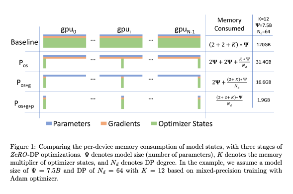

# Zero redundancy optimizer Tutorial
- Authors: Jinwon Kim




The Zero Redundancy Optimizer for Data Parallelism (ZeRO-DP) is a technique used to remove memory state redundancies and optimize computational efficiency in data parallel distributed deep learning. ZeRO-DP partitions the model states across data-parallel processes, eliminating the need for replication of model parameters, which in turn reduces memory usage and communication overhead during training.

## Optimizer State Partitioning (Level 1)
-  The optimizer states are partitioned across data parallel processes
## Gradient Partitioning (Level 2)
-  The reduced gradients are partitioned based on the corresponding parameters and are reduced only by the data parallel process responsible for updating those parameters. After the reduction, the memory can be released.
## Parameter Partitioning (Level 3)
- Similar to the optimizer states and gradients, each process only stores the parameters associated with its partition.

### Table of contents  
- [Data Parallelism Tutorial](#)
    - [Table of contents](#table-of-contents)
  - [0. Distributed Launcher](#0-distributed-launcher)
  - [1. Training](#1-training)
    - [1.1. Initialize some variables](#21-initialize-some-variables)
    - [1.2. Create model, optimizer and tokenizer](#22-create-model-optimizer-and-tokenizer)
    - [1.3. Parallelize the model](#23-parallelize-the-model)
    - [1.4. Load dataset and create dataloader](#24-load-dataset-and-create-dataloader)
    - [1.5. Do training as usual](#25-do-training-as-usual)
    - [1.6. Save the parallelized model](#26-save-the-parallelized-model)
  - [Appendix. Multi-node Training](#appendix-multi-node-training)

## 0. Distributed Launcher

This tutorial must be launched using distributed launcher.

If you have 4 GPUs:

```bash
torchrun --nproc_per_node=4 YOUR_SCRIPT.py
```

If you installed Slurm in your environments, the following works the same.

```bash
srun --num_gpus=4 YOUR_SCRIPT.py
```

For more information of the distributed launchers, refer to:

- [Pytorch documents](https://pytorch.org/docs/stable/distributed.html)
- [DeepSpeed documents](https://www.deepspeed.ai/getting-started/#launching-deepspeed-training)


## 1. Training

How to use the zero data parallelism for training?

### 1.1. Initialize some variables

```
BATCH_SIZE = 4
SEQ_LEN = 64
SAVE_INTERVAL = 50
TRAIN_STEP = 100
```

### 1.2. Create model, optimizer and tokenizer

```python
from torch.optim import Adam
from transformers import AutoModelForCausalLM, AutoTokenizer

model = AutoModelForCausalLM.from_pretrained("gpt2")
optimizer = Adam(model.parameters(), lr=3e-5)
tokenizer = AutoTokenizer.from_pretrained("gpt2")

# Add pad token for batch training because GPT2 tokenizer doesn't have pad token.
tokenizer.pad_token = tokenizer.eos_token
```

### 1.3. Parallelize the optimizer

```python
# model = defined in section 1.2

from oslo import ParallelContext, ParallelMode
from oslo.torch.nn.parallel.data_parallel.zero import ZeroRedundancyOptimizer

dp_size = 4

parallel_context = ParallelContext.from_torch(
    data_parallel_size=dp_size,
)
```

### 1.3.1 Zero 1
```python
# create optimizer
optimizer = ZeroRedundancyOptimizer(
    Adam(model.parameters(), lr=3e-5),
    parallel_context=parallel_context,
    overlap_communication=True,
)
```

### 1.3.2 Zero 2
```python
# create optimizer
optimizer = ZeroRedundancyOptimizer(
    Adam(model.parameters(), lr=3e-5),
    parallel_context=parallel_context,
    overlap_communication=True,
    partition_grad=True,
)
```

### 1.4. Load dataset and create dataloader

In this tutorial, We're going to use `datasets` library of Hugging Face.

``` python
from datasets import load_dataset
from torch.utils.data import DataLoader, DistributedSampler

    rank = parallel_context.get_local_rank(ParallelMode.DATA)

    datasets = load_dataset("squad").data["train"]["context"]
    datasets = [str(_) for _ in datasets[: TRAIN_STEP * BATCH_SIZE]]
    train_sampler = DistributedSampler(
        datasets, num_replicas=LOCAL_WORLD_SIZE, rank=rank
    )
    dataloader = DataLoader(datasets, batch_size=BATCH_SIZE, sampler=train_sampler)
```

### 1.5. Do training as usual
- Note: Please do not use `optimizer.zero_grad()`, the standard way to use is `model.zero_grad()`
```python
for step, batch in enumerate(dataloader):
    model.zero_grad()

    # Make batch
    input_batch = tokenizer(
        batch,
        return_tensors="pt",
        padding=True,
        truncation=True,
        max_length=SEQ_LEN,
    ).to("cuda")

    # Forward-Backward-Step
    loss = model(**input_batch, labels=input_batch["input_ids"]).loss
    loss.backward()
    optimizer.step()
```

## Appendix. Multi-node Training

There are three types of training methods are supported by oslo.

1. torch distributed ( torchrun, recommended )
    
    ```bash
    # Node #1
    torchrun --nnodes=2 --node_rank=0 --nproc_per_node=4 --master_addr=${YOUR_NODE_ADDRESS} --master_port=${PORT} YOUR_SCRIPT.py
    
    # Node #2
    torchrun --nnodes=2 --node_rank=1 --nproc_per_node=4 --master_addr=${YOUR_NODE_ADDRESS} --master_port=${PORT} YOUR_SCRIPT.py
    ```
    
2. Slurm : Slurm using SBATCH file, and then running sbatch sbatch_file.sh command.
    
    ```bash
    #!/bin/bash
    #SBATCH --job-name=${JOBNAME}
    #SBATCH --partition=gpu
    #SBATCH --time=infinite
    
    ### e.g. request 8 nodes with 8 gpu each, totally 64 gpus (WORLD_SIZE==64)
    ### Note: --gres=gpu:x should equal to ntasks-per-node
    #SBATCH --nodes=4
    #SBATCH --ntasks-per-node=4
    #SBATCH --cpus-per-task=6
    #SBATCH --gres=gpu:4             # number of gpus per node
    #SBATCH --mem=64gb
    
    export HOSTNAMES=`scontrol show hostnames "$SLURM_JOB_NODELIST"`
    export MASTER_ADDR=$(scontrol show hostnames "$SLURM_JOB_NODELIST" | head -n 1)
    export MASTER_PORT=${PORT}
    export COUNT_NODE=`scontrol show hostnames "$SLURM_JOB_NODELIST" | wc -l`
    
    python YOUR_SCRIPT.py
    ```
    
    And then, run
    
    ```bash
    sbatch sbatch_file.py
    ```
